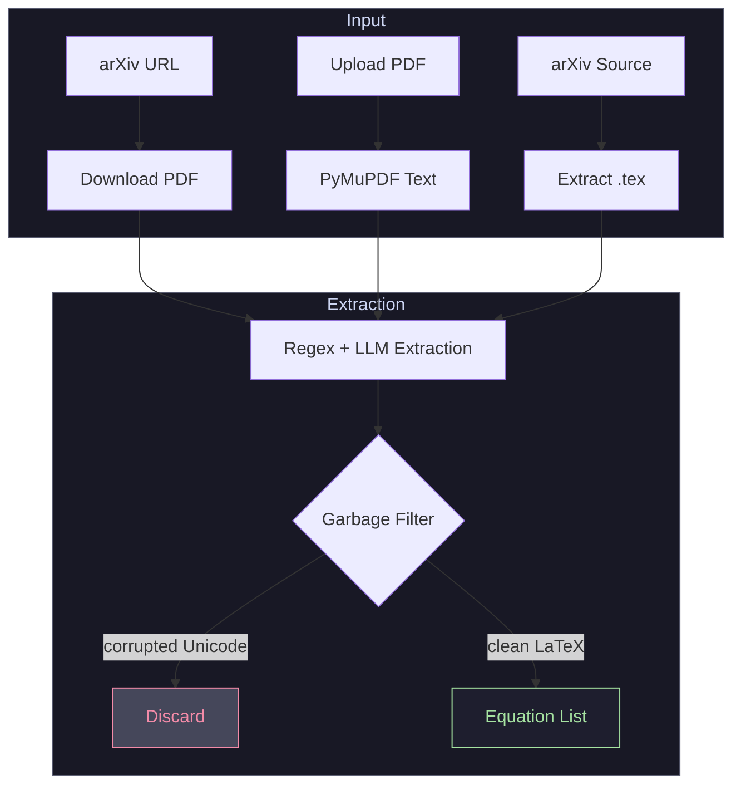
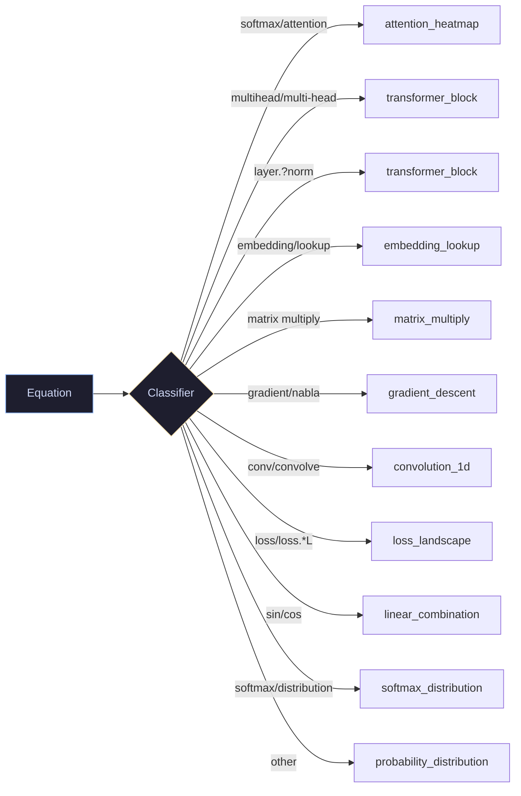
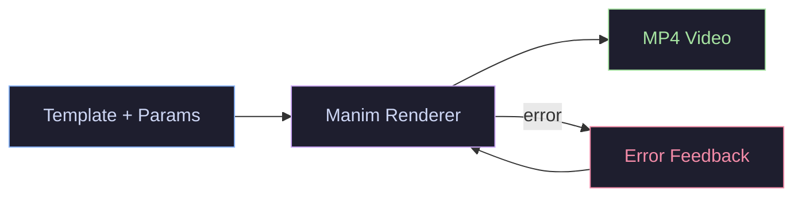
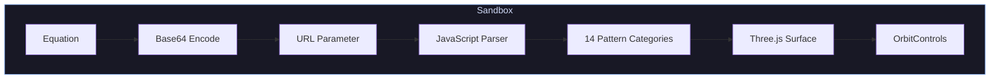
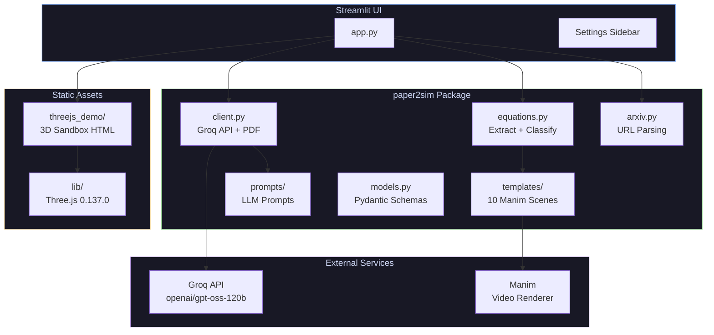

<p align="center">
  
</p>

<h1 align="center">Paper2Sim</h1>

<p align="center">
  <strong>arXiv → Equations → Animated Videos → 3D Sandbox</strong><br/>
  <em>AI-powered pipeline that turns academic papers into interactive math visualizations</em>
</p>

<p align="center">
  <a href="#quickstart">Quickstart</a> ·
  <a href="#architecture">Architecture</a> ·
  <a href="#3d-sandbox">3D Sandbox</a> ·
  <a href="#templates">Templates</a> ·
  <a href="#roadmap">Roadmap</a>
</p>

---

## The Problem

Reading "Attention Is All You Need" and staring at the scaled dot-product formula:

$$\text{Attention}(Q, K, V) = \text{softmax}\left(\frac{QK^T}{\sqrt{d_k}}\right)V$$

You can parse the symbols. But can you *see* it? Can you drag the matrices around, watch them multiply, and feel why the $\sqrt{d_k}$ scaling matters?

**Paper2Sim makes that possible.** Feed it any arXiv paper. It extracts every equation, generates Manim animations, and drops you into an interactive 3D sandbox where you can play with the math.

---

## Pipeline Overview


### Stage 1: Equation Extraction



**How it works:**
1. **arXiv URL** → download PDF + optional `.tex` source
2. **PDF upload** → PyMuPDF extracts raw text
3. **Source upload** → regex pulls `equation`/`align` environments directly from LaTeX
4. **Garbage filter** rejects corrupted Unicode (>10% non-ASCII) that some PDFs produce
5. **LLM fallback** via Groq (`openai/gpt-oss-120b`) for equations the regex misses

### Stage 2: Classification & Template Mapping



Each equation is pattern-matched to one of **10 Manim templates**. The classifier checks attention/multihead/layernorm patterns first (before the generic `\frac` catch-all) to avoid misclassification.

### Stage 3: Video Rendering



- **10 pre-built Manim templates** — no LLM code generation needed
- **Parameterized** — each template accepts dynamic values from the equation
- **Per-equation videos** — each equation gets its own rendered MP4
- **Recursive fallback** — searches `media/videos/` at multiple directory depths

---

## 3D Sandbox

An interactive Three.js surface plotter that visualizes any equation as a 3D surface.



**Features:**
- **Auto-matches ANY equation** — pattern-matches 14 categories (softmax, exp, sin/cos, frac, matrix, ReLU, etc.)
- **No hardcoding** — unlike the original v1 which only worked for specific equations
- **Base64 transport** — equations encoded to avoid URL escaping issues with LaTeX backslashes
- **Three.js 0.137.0 bundled locally** — no CDN dependency (fixes ORB blocking)
- **OrbitControls** — drag to rotate, scroll to zoom, shift+drag to pan

---

## Templates

| Template | What It Shows | Trigger Patterns |
|----------|---------------|------------------|
| `matrix_multiply` | Matrix multiplication animation | `matrix`, `multiply`, `\cdot`, `\times` |
| `attention_heatmap` | Attention weight heatmap | `attention`, `softmax`, `scale` |
| `gradient_descent` | Gradient descent on loss surface | `gradient`, `nabla`, `\partial` |
| `convolution_1d` | 1D convolution operation | `conv`, `convolve`, `kernel` |
| `softmax_distribution` | Softmax probability distribution | `softmax`, `distribution`, `probability` |
| `embedding_lookup` | Embedding vector lookup | `embedding`, `lookup`, `vector` |
| `loss_landscape` | Loss function landscape | `loss`, `L=`, `L(`, `minimize` |
| `transformer_block` | Transformer block diagram | `multi-head`, `layer.?norm`, `feed.?forward` |
| `linear_combination` | Linear combination of vectors | `sin`, `cos`, `linear`, `combination` |
| `probability_distribution` | Probability distribution curve | `pdf`, `gaussian`, `normal`, fallback |

---

## Quickstart

### Prerequisites

- Python 3.12+
- [uv](https://docs.astral.sh/uv/) package manager
- System deps for Manim: `libcairo2-dev libpango1.0-dev libharfbuzz-dev libfribidi-dev libfontconfig-dev libfreetype-dev`
- Groq API key (free at [console.groq.com](https://console.groq.com))

### Install

```bash
git clone https://github.com/Bappaditya-kuilya/paper2sim.git
cd paper2sim
uv sync

# Install Manim system dependencies (Ubuntu/Debian)
sudo apt install libcairo2-dev libpango1.0-dev libharfbuzz-dev libfribidi-dev libfontconfig-dev libfreetype-dev

# Set up API key
cp .env.example .env
# Edit .env → GROQ_API_KEY=gsk_...
```

### Run

```bash
uv run streamlit run app.py
```

Open [http://localhost:8501](http://localhost:8501).

### Usage

1. **Paste an arXiv URL** (e.g., `https://arxiv.org/abs/1706.03762`) or **upload a PDF**
2. Click **Extract Equations** — see all equations appear in the sidebar
3. Click **Render Videos** — Manim renders each equation as a separate MP4
4. Click **Open 3D Sandbox** — explore equations as interactive 3D surfaces

---

## Architecture



---

## Tech Stack


| Component | Purpose |
|-----------|---------|
| **Groq API** | Fast inference for equation extraction + classification |
| **Manim** | 3Blue1Brown-style mathematical animation engine |
| **Three.js** | Interactive 3D surface plotting in the sandbox |
| **PyMuPDF** | PDF text extraction |
| **Streamlit** | Web UI with sidebar controls |
| **Pydantic** | Schema validation for LLM outputs |

---

## API Usage

```python
from paper2sim import Paper2SimBreakdownClient, Paper2SimAnimationClient
from paper2sim.equations import extract_equations_from_text, classify_and_map

# Extract equations from text
equations = extract_equations_from_text(raw_text)
mappings = classify_and_map(equations)

# Or use the Groq client directly
from openai import OpenAI
from paper2sim.client import Paper2SimBreakdownClient

client = Paper2SimBreakdownClient(
    api_key="gsk_...",
    model="openai/gpt-oss-120b"
)
```

---

## Roadmap

```mermaid
flowchart LR
    subgraph Now["v0.1 - Current"]
        A[Equation extraction]
        B[10 Manim templates]
        C[3D Sandbox]
        D[arXiv integration]
    end

    subgraph Next["v0.2 - Next"]
        E[TTS narration]
        F[Full-paper breakdown]
        G[Custom template upload]
        H[Export as GIF]
    end

    subgraph Future["v1.0 - Vision"]
        I[RL-trained Manim agent]
        J[Video feedback loop]
        K[Multi-language]
        L[Browser extension]
    end

    Now --> Next --> Future

    style Now fill:#1e1e2e,stroke:#a6e3a1,color:#a6e3a1
    style Next fill:#1e1e2e,stroke:#f9e2af,color:#f9e2af
    style Future fill:#1e1e2e,stroke:#cba6f7,color:#cba6f7
```



---

## License

[CC-BY-NC-SA-4.0](LICENSE) — free to share and adapt for non-commercial purposes with attribution.

---

<p align="center">
  Built with curiosity and too much coffee.
</p>
