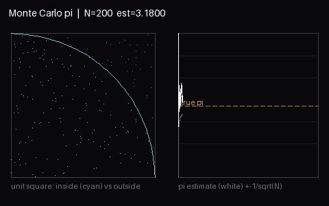

#  Paper2Sim

Feed it a paper. It extracts the testable claim, writes and runs a simulation to check that claim, and renders the result as a live, orbit-able 3D scene.

**Live:** [paper2sim.vercel.app](https://paper2sim.vercel.app/) · **API:** [paper2sim.onrender.com](https://paper2sim.onrender.com/docs)



_Illustrative animation (not a UI screen recording): Monte Carlo π convergence over N=200→6000 — left, random points inside (cyan) vs outside the quarter-circle; right, running π estimate (white) vs true π (dashed amber) with ±1/√N envelope. Rendered with PIL._

## How it works

One async job, five stages, one state machine:

```
queued → ingesting → analyzing → generating → executing ⇄ repairing → summarizing → completed
                                                                                     ↘ failed
```

| Stage | What happens |
|-------|--------------|
| Ingest | arXiv id → title + abstract (cached 24h). PDF → text. Paste → as-is. Trimmed to 24k chars. |
| Analyze | LLM returns `{claim, why_it_matters, simulation_plan, viz_type}`. Defensive parse, `generic` fallback. |
| Generate | LLM writes one self-contained script (stdlib + numpy/scipy/sympy/networkx/pandas/matplotlib/PIL) that emits `scene.json` + a `RESULT_JSON` final line. One strict retry if no code block. |
| Execute + repair | Sandboxed run (AST import allowlist, rlimits, isolated env, no-network jail). stderr fed back to the LLM, up to 3 repairs. Clean exit without `scene.json` counts as failure. |
| Summarize | Plain-language verdict grounded in the measured metrics, with a confidence caveat. Canned summary on failure — no silent errors. |

A real run: Monte Carlo π completed in 13s on the free tier — slope −0.48 vs theoretical −0.5, R² 0.85, verdict `supported`.

## Simulate UI

Sidebar → **Simulate**: arXiv / equation / PDF tabs plus a one-click sample. The 5-stage stepper lights up live (polls every 2s), then shows the claim, verdict banner, interactive 3D scene (drag to rotate, scroll to zoom), metrics, generated code and stdout/stderr (collapsed), and any `figure_*.png|gif` artifacts. Recent runs below, shareable via job URL.

## Quickstart

```bash
# Backend
pip install -r requirements.txt
uvicorn api:app --reload            # http://localhost:8000/docs

# Frontend
cd frontend && npm install && npm run dev   # VITE_API_URL=http://localhost:8000

# Submit without the UI
curl -F 'text=We claim Monte Carlo pi converges at O(1/sqrt(N)).' http://localhost:8000/api/papers
curl http://localhost:8000/api/jobs/<job_id>   # poll to completed|failed
```

No API key? The mock provider runs a Monte Carlo π job end-to-end offline — `pytest tests/` needs nothing else.

## API

| Method | Endpoint | Description |
|--------|----------|-------------|
| GET | `/health` | Health check |
| POST | `/api/papers` | Submit (form: `text` \| `arxiv` \| `file` PDF ≤20MB) → `{job_id}`. 400 on bad input, 20/hour per IP |
| GET | `/api/jobs` | Recent jobs, newest first |
| GET | `/api/jobs/{id}` | Full record: status, analysis, code, execution, scene, verdict, summary |
| GET | `/api/jobs/{id}/artifacts/{fname}` | Generated figures |
| POST | `/api/extract` | Equations from text/URL (legacy) |
| POST | `/api/extract/upload` | Equations from PDF (legacy) |
| POST | `/api/breakdown` | Equation explanations via LLM |
| POST | `/api/storyboard` | Animation plan via LLM |

## Env

Copy `.env.example` → `.env`. LLM fallback chain (first key found wins, mock last resort): `GROQ_API_KEY` (+`GROQ_MODEL`, default `openai/gpt-oss-20b`), `OPENROUTER_API_KEY` (+`OPENROUTER_MODEL`, default `openrouter/free`), `GOOGLE_AI_STUDIO_API_KEY` (+`GOOGLE_MODEL`). Storage: `DATA_DIR` (default `./data`), `JOBS_DB`. Tuning: `MAX_REPAIR_ATTEMPTS`, `SANDBOX_TIMEOUT_SECONDS`, `SANDBOX_MAX_MEMORY_MB`, `SANDBOX_NO_NET=0` to opt out of the net jail, `SENTRY_DSN` (optional). Give each teammate their own Groq key locally — the free tier shares one 30 req/min pool per org.

## Architecture

```
React (Vercel) ──POST /api/papers──▶ FastAPI (Render, BackgroundTasks)
                                            │  SQLite jobs + arXiv cache
                                            ▼
                                   analyze → generate → sandbox ⇄ repair → summarize
                                                                  (bwrap --unshare-net)
```

No Celery/Redis day one — re-add when concurrent jobs block the API. No forked code; the scene contract (`scene.json` → `RendererSelector` + `TrajectoryRenderer`) is the only sandbox↔frontend coupling.

## Develop

```bash
pip install -e ".[dev]"
pytest tests/ -q                    # 140 tests, mock LLM
ruff check src/ tests/ api.py
mypy src/ --ignore-missing-imports
cd frontend && npm run typecheck && npm run test
```

## License

CC-BY-NC-SA-4.0
